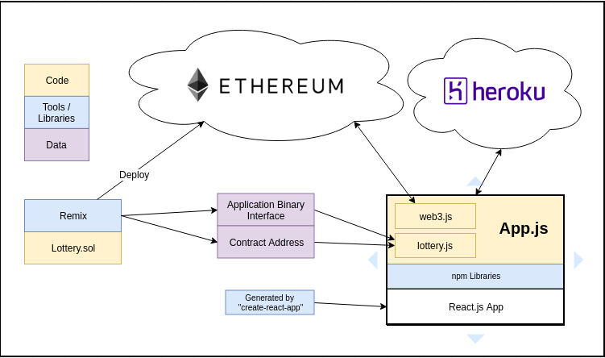
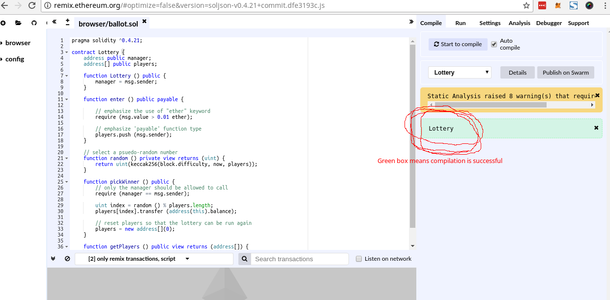
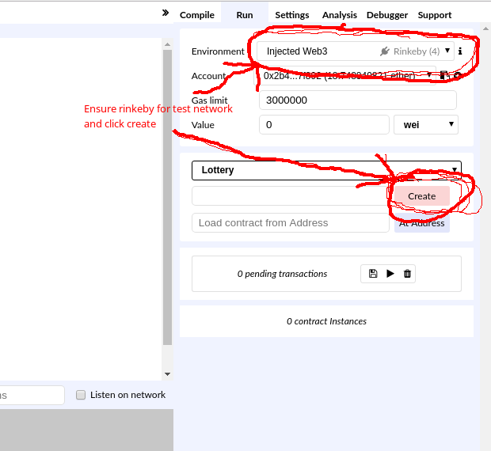
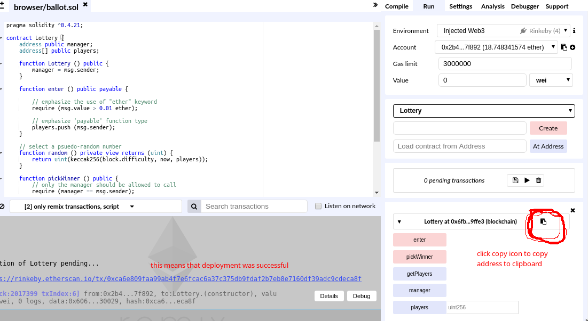
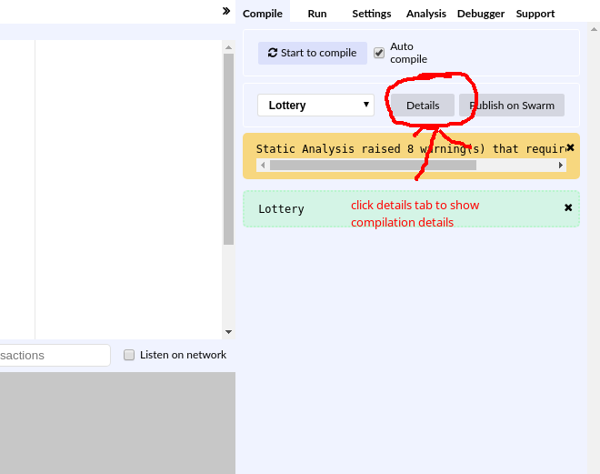
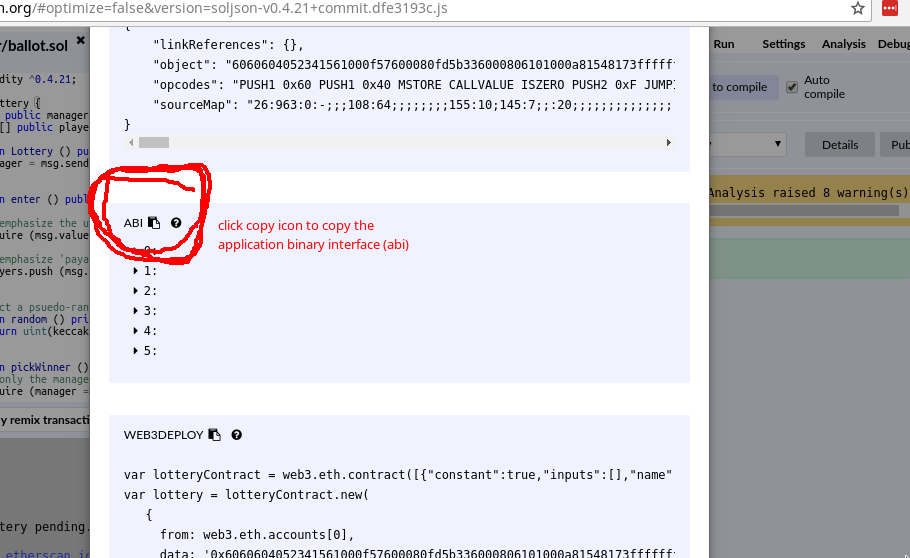
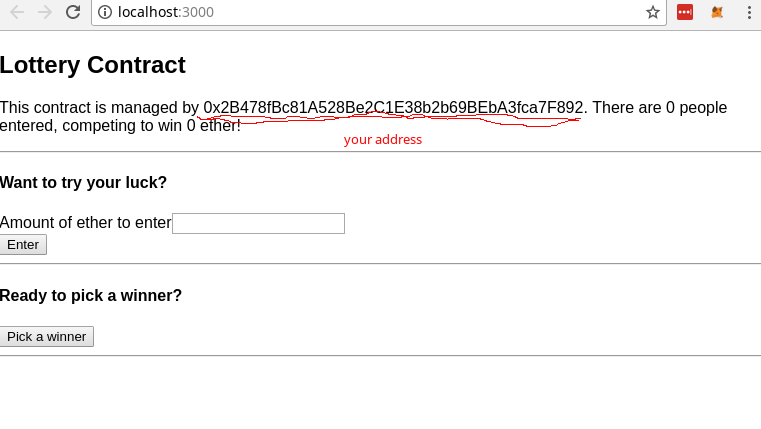

# Jump Start with Ethereum, React, and Heroku

### Developed for NYC Blockchain Hack - 2018-03-31



## Prerequisites

* [Atom Text Editor](https://atom.io) (Or other text editor of your choice)
* [Node.js](https://nodejs.org/en/)- installed
* [MetaMask](https://metamask.io/) - installed
  * [with test ether](https://faucet.rinkeby.io/) - deposited into your account
* [Heroku](https://heroku.com) - account setup with command line tools installed

## Steps

### Author Lottery Smart Contract in Remix

Go to http://remix.ethereum.org.

Paste the following code from the Lottery contract into Remix.

```
pragma solidity ^0.4.21;

contract Lottery {
    address public manager;
    address[] public players;

    function Lottery () public {
        manager = msg.sender;
    }

    function enter () public payable {
        require (msg.value > 0.01 ether);
        players.push (msg.sender);
    }

    // select a psuedo-random number
    function random () private view returns (uint) {
        return uint(keccak256(block.difficulty, now, players));
    }

    function pickWinner () public {
        // only the manager should be allowed to call
        require (manager == msg.sender);

        uint index = random () % players.length;
        players[index].transfer (address(this).balance);

        // reset players so that the lottery can be run again
        players = new address[](0);
    }

    function getPlayers () public view returns (address[]) {
        return players;
    }
}
```

You should test your contract within Remix. We will come back to this after we setup our web application project.

### Setup Project and Install Dependencies

#### Install create-react-app, create template application, and open in Atom

```
npm install -g create-react-app
create-react-app my_app
cd my_app
atom .
```

To test the new application, run

```
npm run start
```

Test altering the src/App.js file.

For an initial test, you can change this line:

```
<h1 className="App-title">Welcome to React</h1>
```

To this line:

```
<h1 className="App-title">Welcome to My Application</h1>
```

Then go back to the browser and ensure that the title is updated.

### Create web3.js File

web3.js will serve as the communications layer to Ethereum.

Install it as a dependency:

```
npm install --save web3@1.0.0-beta.26
```

Inside get_started/src folder, create a new file named "web3.js"

Use the following code. It grabs the provider from MetaMask using `window.web3.currentProvider` and creates an instance of web3 using our installed version (1.0.0-beta.26).

```
import Web3 from "web3";

const web3 = new Web3(window.web3.currentProvider);

export default web3;
```

### Create lottery.js file

lottery.js will provide an operational contract interface to our React application.

Inside get_started/src folder, create a new file named "lottery.js"

Use the following code, and then we will paste the abi and address from Remix into this file.

```
import web3 from "./web3";

const address = " <... paste from remix...> ";

const abi = [ <... paste from remix ...> ];

export default new web3.eth.Contract(abi, address);
```

### Deploy Smart Contract in Remix and Connect lottery.js

Click on "Start to Compile" and ensure that the "Lottery" shows in a green box.



Ensure rinkeby is selected and click create



MetaMask will pop up. Confirm the transaction in MetaMask.

Click copy icon to copy contract address to clipboard.


Paste the contract address into the lottery.js file.

On the Compile tab, click the Details button and then copy the ABI by clicking the copy button.





Paste the ABI into the lottery.js file.

### Update src/App.js

Add imports to App.js

```
import web3 from "./web3";
import lottery from "./lottery";
```

Add a state object to the App class to store values from our lottery contract.

```
class App extends Component {
  state = {
    manager: "",
    players: "",
    balance: "",
    value: "",
    message: ""
  };
...
...
```

In React, the "componentDidMount()" method is the place to put code that queries data and saves that data to the state object. Add the following componentDidMount() method.

```
async componentDidMount() {

    const manager = await lottery.methods.manager().call();
    const players = await lottery.methods.getPlayers().call();
    const balance = await web3.eth.getBalance(lottery.options.address);

    this.setState({ manager, players, balance });
  }
```

Add an onSubmit method that we'll use for players to enter the lottery.

```
enterLottery = async event => {
    // prevents normal form submission
    event.preventDefault();

    const accounts = await web3.eth.getAccounts();

    // put this in a bit later
    this.setState({ message: "Waiting on transaction success..." });

    await lottery.methods.enter().send({
      from: accounts[0],
      value: web3.utils.toWei(this.state.value, "ether")
    });

    // put this in a bit later
    this.setState({ message: "You have been entered!" });
  };
```

Add an onClick method that we'll use to pick the winner for our lottery.

```
pickWinner = async event => {
    const accounts = await web3.eth.getAccounts();

    this.setState({ message: "Waiting on transaction success..." });

    console.log(
      await lottery.methods.pickWinner().send({
        from: accounts[0]
      })
    );

    this.setState({ message: "Winner has been picked!" });
  };
```

Update the render method to show the correct visualizations and form elements.

```
render() {
    return (
      <div>
        <h2>Lottery Contract</h2>
        <p>
          This contract is managed by {this.state.manager}. There are{" "}
          {this.state.players.length} people entered, competing to win{" "}
          {web3.utils.fromWei(this.state.balance, "ether")} ether!
        </p>
        <hr />

        <form onSubmit={this.enterLottery}>
          <h4>Want to try your luck?</h4>
          <div>
            <label>Amount of ether to enter</label>
            <input
              value={this.state.value}
              onChange={event => this.setState({ value: event.target.value })}
            />
          </div>
          <button>Enter</button>
        </form>
        <hr />
        <h4>Ready to pick a winner?</h4>
        <button onClick={this.pickWinner}>Pick a winner</button>
        <hr />
        <h1>{this.state.message}</h1>
      </div>
    );
  }
```

If it isn't running already, start your react app with

```
npm run start
```

Your lottery interface should look like this:


### Deploy to Heroku

With a heroku account, the command line tools installed, and ssh enabled, run the following commands::

```
heroku login
heroku create
```

Note the app name assigned by heroku.

```
git init
git add .
git commit -m "initial commit"
heroku git:remote -a <app-name>
git push heroku master
heroku open
```
